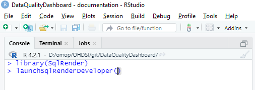

<!--
%\VignetteEngine{knitr::knitr}
%\VignetteIndexEntry{Add a New Data Quality Check}
-->

# Add a New Check to Data Quality Dashboard
## Steps
1. Write the SQL query for your check.
1. Format the Query for the Data Quality Dashboard
1. Add the Query to Check Descriptions File
1. Add Hooks to Field, Table or Concept Check CSV File

The following will show, by example, how to add a check that emergency visits in the CDM are less than or equal to two days.
## Write the SQL Query for Your Check
The query should return the number of rows that fail the check, i.e. the duration of the ER visit is greater than two days.

		SELECT count(*)
		FROM visit_occurrence
		WHERE visit_concept_id = 9203 /* ER visit */
		  AND dateDiff(days, visit_start_date, visit_end_date) > 2;

## Format the Query for the Data Quality Dashboard
In the DataQualityDashboard git directory DataQualityDashboard/inst/sql/sql_server are the SQL files that implement the various data quality checks. The files have the following input parameters:
@cdmDatabaseSchema
@vocabDatabaseSchema
@cdmTableName
@cdmFieldName

And the result of the query is expected to have the following fields:
num_violated_rows; pct_violated_rows; num_denominator_rows

Its best to find an existing query similar to the test you want to implement and use that as a starting point for your test query. 
 

		SELECT num_violated_rows
		    , CASE WHEN denominator.num_rows = 0 
		           THEN 0 
		           ELSE 1.0*dqd_check.num_violated_rows/denominator.num_rows 
		     END  AS pct_violated_rows, 
		  denominator.num_rows as num_denominator_rows
		FROM
		(
			<Your query that returns num_violated_rows>
			 
		) dqd_check
		CROSS JOIN
		( 
			SELECT COUNT_BIG(*) AS num_rows
			FROM @cdmDatabaseSchema.@cdmTableName cdmTable
		) denominator;

The initial query should then be set up to use the input parameters.  This test is only valid for Visit Occurrence  and the columns visit_start_date, visit_end_date, and visit_concept_id are fixed. As a result we only need to add the @cdmDatabaseSchema and @cdmTableName parameters and alias the count(*) field to **num_violated_rows**

		SELECT count(*) AS num_violated_rows
		FROM @cdmDatabaseSchema.@cdmTableName
		WHERE visit_concept_id = 9203 /* ER visit */
		 AND dateDiff(days, visit_start_date, visit_end_date) > 2

Paste the check for violating rows into the template from a similar query and test the complete query on a OMOP CDM. A good way to confirm that the input parameters are correct is to use launchSqlRenderDeveloper from the SQLRender package. The package is included in the Data Quality R project.

This will bring up a SqlRender window in your browser. Paste in your complete DQ query. The program will see the input parameters and allow you to define them. The rendered translation, dialect specific, is output. You can run the "Rendered Translation" on your OMOP CDM.

SQL Server SQL is the lingua franca for Data Quality Dashboard queries. SQLRender will modify the query to other SQL dialects. See [SQLRender on CRAN](https://cran.r-project.org/web/packages/SqlRender/index.html) for additional information. When satisfied with the results of the query save the SQL in a file named ERVisitLength.sql in the directory DataQualityDashboard/inst/sql/sql_server.

## Add the Query to Check Descriptions File
The Check Description file is found in the DataQualityDashboard/inst/csv directory. There is a Check Description for each CDM release.  Within the Check Description file are the following columns:
- checkLevel -- Possible values are TABLE, FIELD or CONCEPT. This is the csv file that has the information telling the DQD code on what tables and fields to run the check. For our example, check of the length of an ER stay, this will be the csv file with field level checks. 
- checkName -- Name used in the DQD code to identify the check. For this example use **ERVisitLength**
- checkDescription -- Short user provided description of what the check does. This description is displayed in the DQD results. 
- kahnContext -- The following 3 columns are a means of organizing quality checks. For additional information see [Harmonized Data Quality Assessment Terminology and Framework](https://www.ncbi.nlm.nih.gov/pmc/articles/PMC5051581/). For this example use 'Verification'
- kahnCategory -- Use 'Plausibility'
- kahnSubcategory -- Use 'Temporal'
- sqlFile -- The name of the SQL file we created above. The name should include the values for checkLevel and checkName.  For example, field_ERVisitLength.sql
- evaluationFilter -- This is a column name in the Field Check csv file and a conditional statement, that when TRUE will result in the DQD code running the check.  This will become clearer after describing how to update the Field Checks csv file in the next section. For this example use **ERVisitLength=='Yes'**. This means run our test when the row value in the column headed ERVisitLength equals Yes.

## Add Hooks to Field/Table/Concept Check CSV File
The field level check file, OMOP_CDMv5.4_Field_Level.csv, is in the same directory as the Check Descriptions file.  The first two columns are 'cdmTableName' and 'cdmFieldName'. There is a row for each table/column in the OMOP CDM. After the first two columns are triplets of columns with the naming scheme **testName**, **testNameThreshold**, **testNameNotes**. We need to add these columns for our ER visit length test. The testName is the name used in defining the evaluationFilter column in the above step, **ERVisitLength**. The other two column names are ERVisitLengthThreshold and ERVisitLengthNotes. The evaluation filter we added, ERVisitLengh=='Yes' means that for every table/column in this file where the row value in the column ERVisitLength is 'Yes', run the SQL in the file we created, ERVisitLength.sql, passing in the schema, table and column names. (The schema name is defined when running the DQD code.) For this example the only row with a Yes will be for the visit_date_date in the visit_occurrence table.

The testNameThreshold column should have a value between 0 and 100 for all rows where there is a Yes in the testName column. Remember the SQL in ERVisitLength.sql returns the pct_violated_rows. If pct_violated_row is greater than the threshold the test is recorded as failed.  If our threshold is 0 then any ER visit with a length greater than two days will return a pct_violated_row greater than zero and the test will fail. If you want to allow for a few 'bad' visit lengths you can set the threshold to a low number. Or if you want the test to be run, but never flag an error, set the threshold to 100.

The testNameNotes column is usually left blank. The convention is that this column will be used by the person running the tests to document circumstances in the source data that might cause the test to fail.

Add the above three columns to the end of the csv file. In the row for Visit Occurrence/Visit start date put 'Yes' in the ERVisitLength column and 0 in the ERVisitLengthThreshold column. Our test will be run once whenever field level checks are run. If any ER visit length is greater than two days the check will be marked as failed.

You can run just the ERVisitLength test by setting the input parameter checkNames = c("ERVisitLength") in the R program DataQualityDashboard::executeDqChecks.

