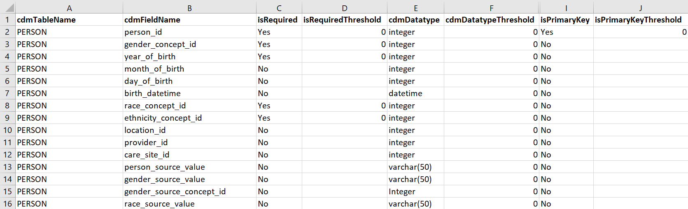

<!--
%\VignetteEngine{knitr::knitr}
%\VignetteIndexEntry{Failure Thresholds and How to Change Them}
-->

# DQD Failure Thresholds

As described in the [introduction to the tool](https://ohdsi.github.io/DataQualityDashboard/#introduction), the Data Quality Dashboard works by systematically applying 20 data quality check types to a database by leveraging the structure of the OMOP Common Data Model. This process results in over 3,300 potential data quality checks. These checks are then resolved against the database, each one producing a number and percent of records that fail. The percent failure is then compared against a number to determine if the check itself should be marked as a pass or a fail overall. Essentially, the threshold number is the percent of failed records for a particular check you are willing to accept. If the percent failures is lower than the threshold then it passes, otherwise the check fails.

A default set of failure thresholds are shipped with the package. Many of these are general thresholds determined by CDM experts and were designed to test the minimum quality measures necessary to run an analysis on a database. They do not take into account an apriori knowledge of the database or data that is available. With that in mind, it is possible to change the failure thresholds and even set different thresholds for different databases.

## DQD Control Files

There is a set of three csv files that underly the DQD. These files indicate which checks should be run and what their failure thresholds should be. There is one file per check level: TABLE, FIELD, and CONCEPT. This vignette will walk through how to update the field level check thresholds but the process is the same for all three files. 

### Step 1: Find and copy the control files

The control files are located in the R package in the inst/csv folder and can also be downloaded [here](https://github.com/OHDSI/DataQualityDashboard/tree/master/inst/csv). In that location there should be four files per CDM version the DQD supports. These are:

- **OMOP_CDMvx.x.x_Check_Descriptions.csv**: This file contains the check types, their descriptions, and which sql file is associated with each. It does not contain any failure thresholds and should not need to be changed. 
- **OMOP_CDMvx.x.x_Table_Level.csv**: This file has a list of all tables in the CDM version and any checks to be performed at this level as well as the failure thresholds associated. Right now only the checktype [measurePersonCompleteness](https://ohdsi.github.io/DataQualityDashboard/articles/CheckTypeDescriptions.html#measurepersoncompleteness) is considered a table level check. If you would like to change the failure thresholds for the measurePersonCompleteness check copy this file to a location the R instance can access.
- **OMOP_CDMvx.x.x_Field_Level.csv**: This file has a list of all tables and fields in the CDM version and any checks to be performed at this level as well as the failure thresholds associated. The majority of the [check types](https://ohdsi.github.io/DataQualityDashboard/articles/CheckTypeDescriptions.html) run by the DQD are field level checks. If you would like to change the failure thresholds for any of these checks copy this file to a location the R instance can access. An example of this file is seen in figure 1 below.



- **OMOP_CDMvx.x.x_Concept_Level.csv**: This file has a list of all concepts and any checks to be performed on that concept. For example, there are checks that evaluate biologically plausible ranges for measurement values, like [plausibleValueLow](https://ohdsi.github.io/DataQualityDashboard/articles/CheckTypeDescriptions.html#plausiblevaluelow-1). If you would like to change the failure thresholds for any of these checks copy this file to a location the R instance can access.

### Step 2: Turn On/Off Checks and Change Thresholds

Using the field level file as an example, when you open it there will be two columns listing the tables and fields in the OMOP CDM, as seen in figure 1. Moving horizontally through the file there will be a column named for each of the [check types](https://ohdsi.github.io/DataQualityDashboard/articles/CheckTypeDescriptions.html) available to run at the field level. At the intersection of each check type and CDM field will be a cell with either a 'Yes' or 'No' value. A 'Yes' indicates that the check type will be run for that specific table and field. For example in figure 1 there is a 'Yes' in the **isRequired** column for the field **person_id** in the **PERSON** table. This means that the [**isRequired**](https://ohdsi.github.io/DataQualityDashboard/articles/CheckTypeDescriptions.html#isRequired) check will be run, substituting **person_id** for cdmFieldName and **PERSON** for cdmTableName.

So instead of the generic check type: *The number and percent of records with a NULL value in the **cdmFieldName** of the **cdmTableName** that is considered not nullable*

The 'Yes' in cell C2 in figure 1 will resolve that check type to an individual data quality check: *The number and percent of records with a NULL value in the **person_id** of the **PERSON** table that is considered not nullable*

Using this method it is possible to turn checks on or off by changing the 'Yes'/'No' values in the control files. This will affect individual checks only. If you would like to filter checks based on check level (TABLE, FIELD, CONCEPT), check type (turn off all fkClass checks, for example), or CDM table (turn off all checks for the COST table), this can be done at the execution step and does not need to be specified in the control file. The vignette **Advanced DQD Execution Options** details how to do this.

For each check type column in the control file there will be one or more additional columns based on the inputs the check type needs to function. For instance the isForeignKey check has the fields fkTableName and fkFieldName so that the check knows where to find the primary key associated with the foreign key. Each check type will also have a column named using the convention **checktype**Threshold. This is the column that lists the threshold against which the check will be evaluated to determine a pass or fail. Similarly to how the 'Yes'/'No' indicators work, the intersection of each CDM field and check type threshold field will hold a value that will be compared to the outcome of the check to determine if the check passes or fails. In figure 1 for the check that is turned on in cell C2 the threshold is listed in cell D2. In this case the value is 0 indicating that if any records in the database violate the rule then this check will fail. 

To change the threshold for a check, input a value between 0 and 100. The threshold value is based on the percent of records that violate a check and indicates the percent of violating records you are willing to tolerate. A 0 thresholds means that any violating records will cause the check to fail and a 100 means that all records evaluated could violate the check and the check will still pass. After changing any thresholds in the control files, save the files in a location that the R instance can access. 

### Step 2a: Documenting Metadata on Updated Thresholds

In addition to thresholds, each check type will also have a column named using the convention **checktype**Notes. These columns allow entry of any information about why a particular check threshold was changed for a certain database, or perhaps record a link to an issue tracking system to denote that a failure has been identified and a fix is in the works. If any notes are recorded these will be exposed in the shiny application. 

### Step 3: Run the DQD Using the Updated Thresholds

Follow the instructions on the [Getting Started](https://ohdsi.github.io/DataQualityDashboard/articles/DataQualityDashboard.html) page to set the parameters to run the Data Quality Dashboard. When running the execute function, point the package to the updated threshold files as shown in the example below. To do this, The options **tableCheckThresholdLoc**, **fieldCheckThresholdLoc**, **conceptCheckThresholdLoc** should contain the fully qualified location of the files. If you would like to revert to the default thresholds these options can be removed from the execute function call or be set to "default".

```r
DataQualityDashboard::executeDqChecks(connectionDetails = connectionDetails, 
                                      cdmDatabaseSchema = cdmDatabaseSchema, 
                                      resultsDatabaseSchema = resultsDatabaseSchema,
                                      cdmSourceName = cdmSourceName, 
                                      numThreads = numThreads,
                                      sqlOnly = sqlOnly, 
                                      outputFolder = outputFolder, 
                                      verboseMode = verboseMode,
                                      writeToTable = writeToTable,
                                      checkLevels = checkLevels,
                                      tablesToExclude = tablesToExclude,
                                      checkNames = checkNames,
                                      tableCheckThresholdLoc = location of the table check file,
                                      fieldCheckThresholdLoc = location of the field check file,
                                      conceptCheckThresholdLoc = location of the concept check file)

```
